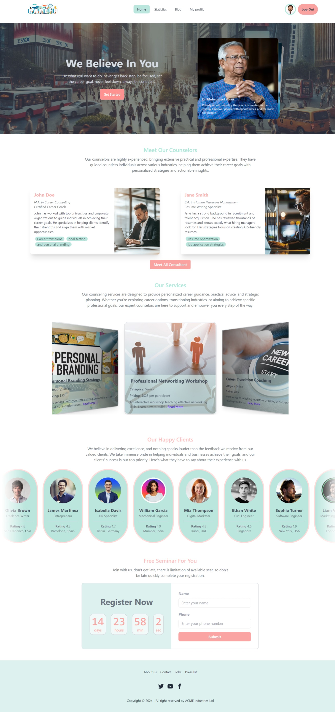
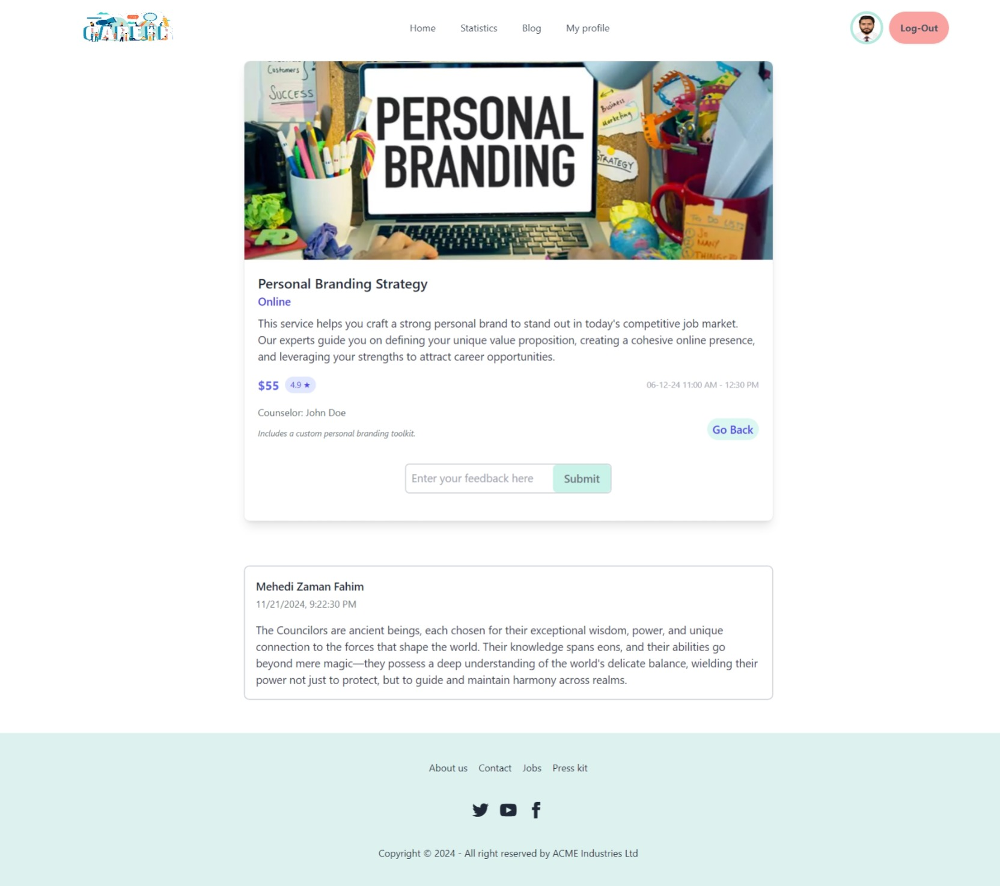
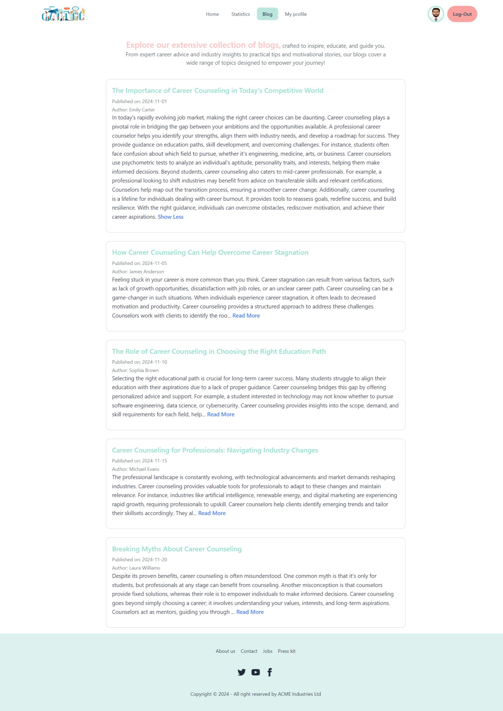
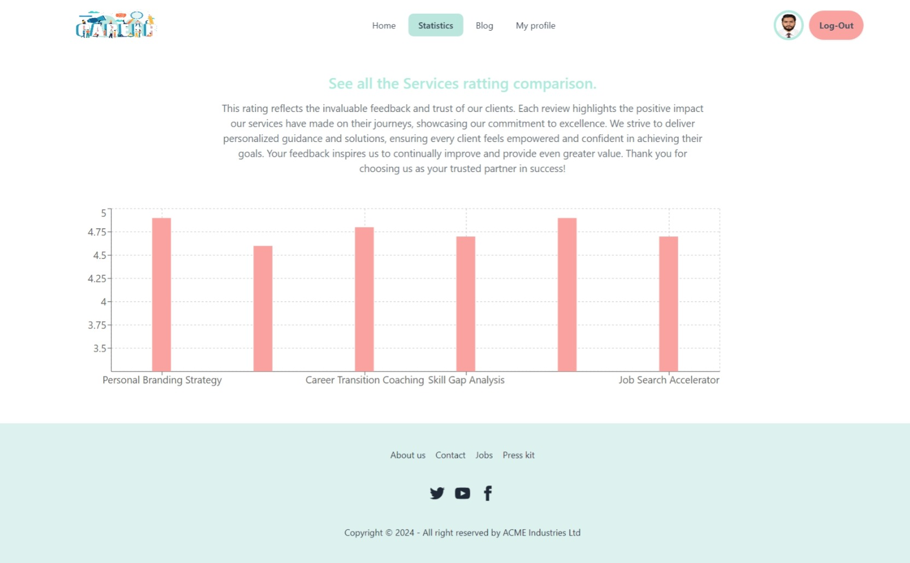
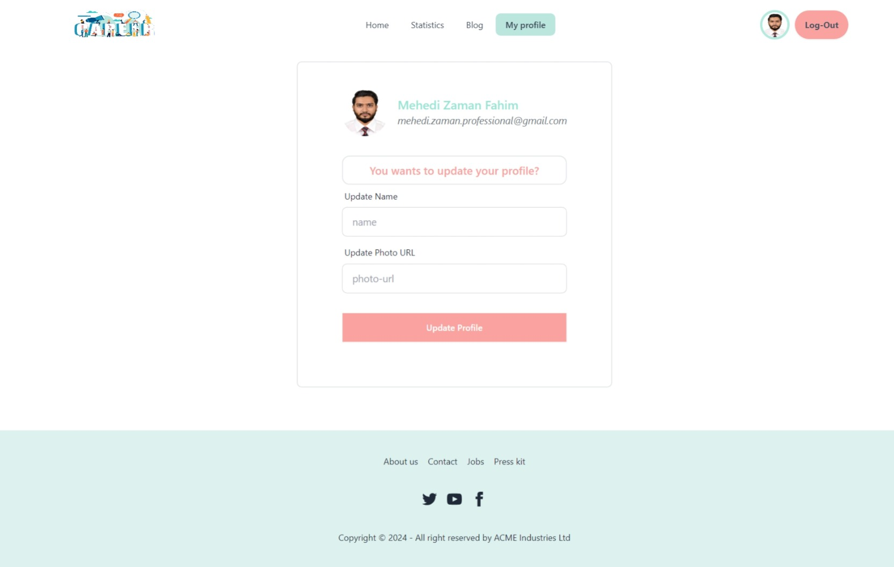

# Project Name: Career Consult (Career Counseling Website).

## Short Description:

Career Counseling Website designed to guide users on their career paths. The goal is to create a seamless, intuitive platform that offers personalized career advice, guidance, and resources to users seeking to make informed decisions about their professional futures. The website will be built using React, React Router, and Firebase for handling routing, user authentication, and data management.

## List of React Fundamental concepts used in the project

1. **JSX (JavaScript XML)**
2. **Components**
3. **Props**
4. **State**
5. **Event Handling**
6. **Conditional Rendering**
7. **useEffect Hook**
8. **CReact Router (Routing)**
9. **Conditional Rendering**
10. **Conditional Rendering**
11. **Conditional Rendering**

## Requirement Document

[Requirement Document Link](https://docs.google.com/document/d/1ErVVKPWEMzrmOn4bp18Vba0nfUpK-KZpqcTvSNffLKU/edit?tab=t.0).

## Live Link Firebase deploy

[Career Consult Web App](https://mz-career-consult.surge.sh/).

## Live Link Surge deploy
[Career Consult Web App](https://career-consult.web.app/).

### Preview

